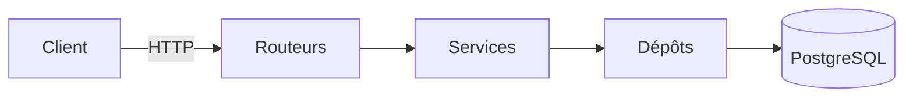

# API Jeux

API REST qui gère un catalogue de jeux vidéo : les jeux, leurs éditeurs et les comptes utilisateurs. Construite avec FastAPI et PostgreSQL.

## Prérequis

- Python 3.12
- Docker Desktop 4 ou plus, avec `docker compose` (pour PostgreSQL 16)
- Git 2.30 ou plus

## Démarrage rapide

Docker Desktop doit être ouvert.

```bash
git clone https://github.com/FloKBCode/api-jeux-LeVice.git
cd api-jeux-LeVice
python -m venv .venv
source .venv/bin/activate          # Windows : .venv\Scripts\activate
pip install -r requirements-dev.txt
cp .env.example .env               # Windows : copy .env.example .env
docker compose up -d --wait base   # lance PostgreSQL et attend qu'il soit prêt
python scripts/peupler.py          # ajoute 8 jeux et un compte admin
fastapi dev app/main.py            # lance l'API
```

Ouvrez http://127.0.0.1:8000/docs : la liste des routes s'affiche.

## Configuration

Les variables sont lues par `app/config.py` dans le fichier `.env`.

| Variable | Rôle | Obligatoire | Par défaut |
|---|---|---|---|
| `DATABASE_URL` | Adresse de la base | Oui | aucune |
| `CLE_SECRETE` | Signe les jetons de connexion | Oui | aucune |
| `DUREE_JETON_MINUTES` | Durée de validité d'un jeton | Non | `30` |
| `ORIGINES_AUTORISEES` | Adresses du front autorisées | Non | `["http://localhost:5173"]` |
| `ENVIRONNEMENT` | `developpement` ou `production` | Non | `developpement` |
| `NIVEAU_JOURNAL` | Niveau de détail des journaux | Non | `INFO` |
| `ECHO_SQL` | Affiche les requêtes SQL | Non | `false` |
| `MAX_TENTATIVES_CONNEXION` | Échecs avant blocage du compte | Non | `5` |
| `FENETRE_TENTATIVES_MINUTES` | Durée du blocage | Non | `15` |

En dehors du local, générez votre propre clé :

```bash
python -c "import secrets; print(secrets.token_urlsafe(32))"
```

## Utilisation

La documentation de toutes les routes est sur http://127.0.0.1:8000/docs. On peut les tester directement depuis cette page.

```bash
curl http://127.0.0.1:8000/sante
curl http://127.0.0.1:8000/api/v1/jeux
curl http://127.0.0.1:8000/api/v1/jeux/statistiques
```

- `/sante` vérifie que l'API et la base répondent.
- `/api/v1/jeux` renvoie la liste des jeux.
- `/api/v1/jeux/statistiques` renvoie le nombre de jeux, la note moyenne et la répartition par genre.

Pour les routes protégées, connectez-vous avec le compte créé par `scripts/peupler.py` : `admin@example.com` / `motdepasse123`.

## Tests

```bash
pytest
ruff check .
```

Tous les tests passent, et ruff affiche `All checks passed!`. Les tests utilisent leur propre base en mémoire : PostgreSQL n'a pas besoin d'être lancé.

## Architecture

Une requête traverse les couches dans un seul sens :



| Dossier | Rôle |
|---|---|
| `app/routeurs/` | Reçoit les requêtes HTTP et renvoie les réponses |
| `app/services/` | Contient les règles métier |
| `app/depots/` | Lit et écrit dans la base |
| `app/tables/` | Décrit les tables de la base |
| `app/modeles/` | Décrit les données reçues et renvoyées |
| `scripts/` | Remplit, importe ou exporte les données |
| `tests/` | Les tests automatiques |

## Contribuer

1. Ouvrir une issue qui décrit le problème.
2. Créer une branche depuis `main` à jour : `fix/7-tri-par-note`.
3. Ouvrir une pull request, relue par un autre membre, avec la CI verte.
4. Fusionner en *Squash and merge*, puis supprimer la branche.

On ne pousse jamais directement sur `main`.